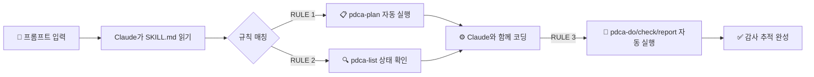

<div align="center">


[](https://www.npmjs.com/package/bkit-doctor)
[](LICENSE)
[](https://claude.ai/code)
[](https://nodejs.org)

[English](README.md) · **한국어** · [日本語](README.ja.md) · [中文](README.zh.md) · [Español](README.es.md)

</div>

---

## 🚀 3초 만에 시작하기

```bash
npx bkit-doctor setup
```

끝입니다. 명령어 하나로 프로젝트를 스캔하고, 문제를 수정하고, Claude Code가 모든 작업을 자동으로 문서화하도록 연결합니다 — 영구적으로.

<details>
<summary>setup이 내부적으로 하는 일 보기</summary>

```
bkit-doctor setup

  [1/4] 🔍 스마트 체크 — AI 설정 파일 누락 여부 스캔 중...
        ✔ .claude/ 디렉터리 확인
        ✔ CLAUDE.md 확인
        ⚠ hooks.json 없음 → 자동 수정 예정

  [2/4] 🏗️  인터랙티브 Init — 누락된 구조 스캐폴딩 중...
        ✔ hooks.json 생성
        ✔ settings.local.json 생성
        ✔ docs/ 스캐폴드 완료

  [3/4] 🛠️  Auto-Fix — CLAUDE.md 적용 중...
        ✔ CLAUDE.md 작성 완료 (백업: CLAUDE_20260330_backup.md)

  [4/4] 🤖 스킬 주입 — SKILL.md + npm 스크립트 생성 중...
        ✔ SKILL.md 생성
        ✔ package.json에 추가: bkit:check, bkit:fix, bkit:setup

  설정 완료. Claude Code가 이제 PDCA 워크플로우를 자동으로 따릅니다.
```

</details>

설정 후에는 npm 단축 명령어를 사용하세요:

```bash
npm run bkit:check   # 프로젝트 진단
npm run bkit:fix     # 전체 자동 수정
npm run bkit:setup   # 언제든 위저드 재실행
```

> **멱등성 & CI 안전.** `setup`을 두 번 실행해도 항상 안전합니다. 비-TTY 환경(CI/CD)에서는 대화형 프롬프트를 건너뛰고 기존 파일을 유지합니다.

---

## 🤖 Claude Code 자동화 원리

`setup`은 프로젝트 루트에 `SKILL.md`를 주입합니다. Claude Code가 이를 프로젝트 컨텍스트로 읽고, **모든 작업마다 자동으로** 세 가지 규칙을 따릅니다. 더 이상 매번 "문서화해줘"라고 말할 필요가 없습니다.



**프로젝트에 주입되는 세 가지 규칙:**

| 규칙 | 실행 시점 | 동작 |
|------|----------|------|
| **RULE 1: 선제적 문서화** | 코딩 시작 전 | `pdca-plan`을 자동 실행해 구조화된 계획 생성 |
| **RULE 2: 상태 동기화** | 코딩 시작 전 | `pdca-list`로 기존 PDCA 상태 확인 |
| **RULE 3: 파이프라인** | 코딩 완료 후 | `pdca-do` → `pdca-check` → `pdca-report` 자동 실행 |

> Claude Code는 `SKILL.md`를 프로젝트 컨텍스트로 읽습니다. 플러그인 설치 없이 즉시 동작합니다.

**결과:** 모든 기능 개발, 버그 수정, 리팩터링이 자동으로 계획·실행·검증·보고됩니다 — 삽질 없이 완벽한 감사 추적이 쌓입니다.

---

## 📦 개별 명령어 (세밀한 제어)

`setup`이 한꺼번에 처리하는 각 단계를 개별적으로 실행하고 싶을 때 사용합니다.

### 🔍 `check` — 프로젝트 상태 진단

```bash
npx bkit-doctor check [--path <dir>]
```

프로젝트 구조 전반에 걸쳐 **16개 진단 검사**를 실행하고 각 항목의 `pass`, `warn`, `fail`을 보고합니다. 하드 실패 시 종료 코드 `1` — CI 친화적.

| 카테고리 | 검사 항목 | 심각도 |
|----------|-----------|--------|
| structure | `.claude/` 디렉터리 | **hard** (exit 1) |
| config | `CLAUDE.md` | **hard** (exit 1) |
| config | `hooks.json`, `settings.local.json` | soft |
| agents | 에이전트 정의 파일 4개 | soft |
| skills | `.claude/skills/` 하위 스킬 파일 7개 | soft |
| policies & templates | 4 + 4개 파일 | soft |
| docs | `docs/01-plan/` → `docs/04-report/`, `output/pdca/` | soft |
| changelog | `CHANGELOG.md` | soft |

---

### 🏗️ `init` — 구조 스캐폴딩

```bash
npx bkit-doctor init [--preset <name>] [--target <name>] [--yes]
```

특정 타깃이나 프리셋 전체를 스캐폴딩합니다.

| 타깃 | 생성 항목 |
|------|----------|
| `claude-root` | `.claude/` 디렉터리 |
| `hooks-json` | `.claude/hooks.json` |
| `settings-local` | `.claude/settings.local.json` |
| `agents-core` | 에이전트 정의 파일 4개 |
| `skills-core` | `.claude/skills/` 하위 SKILL.md 파일 7개 |
| `templates-core` | 문서 템플릿 4개 |
| `policies-core` | 정책 파일 4개 |
| `docs-core` | 모든 `docs/` 디렉터리 |
| `docs-pdca` | `output/pdca/` 디렉터리 |
| `docs-changelog` | `CHANGELOG.md` |

**프리셋:** `default` (전체) · `lean` (최소) · `workflow-core` · `docs`

---

### 🛠️ `fix` — 자동 수정

```bash
npx bkit-doctor fix [--yes] [--dry-run]
```

`check → recommend → init`을 순서대로 실행합니다. `--dry-run`으로 실제 변경 전 미리 보기, `--yes`로 확인 프롬프트 생략.

---

### 🤖 `skill` — 자동화 규칙 주입

```bash
npx bkit-doctor skill [--append-claude] [--overwrite] [--stdout] [--dry-run]
```

세 가지 PDCA 자동화 규칙이 담긴 `SKILL.md`를 생성합니다. `--append-claude`를 사용하면 `CLAUDE.md`에 직접 주입됩니다.

---

## 🛠️ 고급 기능 & 유지 관리

### 🧹 `clear` — 안전한 정리

```bash
npx bkit-doctor clear [--path <dir>]
```

> ⚠️ **명시적 확인 필요.** bkit-doctor가 생성한 파일 목록을 대화형으로 보여주고 삭제 전 반드시 확인을 요청합니다. 데이터가 조용히 삭제되는 일은 없습니다.

---

### 📋 `pdca` — PDCA 문서 엔진

모든 작업에 대해 구조화된 Plan-Do-Check-Act 문서를 생성합니다. 상태는 `.bkit-doctor/pdca-state.json`에 추적됩니다.

```bash
# 원샷: 전체 가이드 한 번에 생성
npx bkit-doctor pdca "사용자 인증" --type feature --owner alice --priority P1

# 또는 단계별로
npx bkit-doctor pdca-plan   "사용자 인증"
npx bkit-doctor pdca-do     "사용자 인증"
npx bkit-doctor pdca-check  "사용자 인증"
npx bkit-doctor pdca-report "사용자 인증"

# 추적 중인 토픽 전체 보기
npx bkit-doctor pdca-list
```

문서 유형: `guideline` · `feature` · `bugfix` · `refactor`

출력: `output/pdca/<slug>-pdca-{stage}.md` — 버전 관리, 감사, git 추적 모두 가능.

---

## 🔗 bkit과 함께 사용하면 더 강력합니다

bkit-doctor는 구조를 강제하고 자동화 규칙을 주입합니다. **[bkit](https://github.com/popup-studio-ai/bkit-claude-code)** 은 Claude Code 내부에서 AI 워크플로우 엔진을 실행하는 플러그인입니다.

| | bkit-doctor | bkit (플러그인) |
|--|-------------|----------------|
| 프로젝트 구조 | ✅ 생성 & 검증 | — |
| CLAUDE.md / SKILL.md | ✅ 생성 | 읽기 |
| PDCA 문서 엔진 | ✅ 파일 생성 | 오케스트레이션 |
| AI 에이전트 & 스킬 | — | ✅ 31개 에이전트 / 36개 스킬 |
| 실행 환경 | 터미널 | Claude Code |

```bash
# Claude Code 내에서 bkit 설치
/plugin marketplace add popup-studio-ai/bkit-claude-code
```

---

## CI 사용법

```yaml
# GitHub Actions
- name: 프로젝트 구조 검사
  run: npx bkit-doctor check
  # .claude/ 또는 CLAUDE.md 없으면 exit 1
```

---

## 기여하기

기여를 환영합니다. 변경하고 싶은 내용이 있으면 먼저 이슈를 열어 논의해 주세요.

1. 저장소 포크
2. 기능 브랜치 생성: `git checkout -b feat/my-feature`
3. 테스트 실행: `npm test`
4. Pull Request 제출

---

## 라이선스

Apache-2.0 © [dotoricode](https://github.com/dotoricode/bkit-doctor)

<div align="center">


Claude Code로 개발하는 모든 이를 위해 만들었습니다.
[GitHub](https://github.com/dotoricode/bkit-doctor) · [npm](https://www.npmjs.com/package/bkit-doctor) · [Changelog](CHANGELOG.md)

</div>
