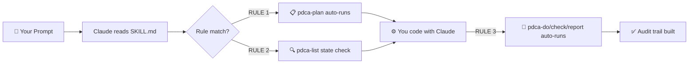

<div align="center">


[](https://www.npmjs.com/package/bkit-doctor)
[](LICENSE)
[](https://claude.ai/code)
[](https://nodejs.org)

**English** · [한국어](README.ko.md) · [日本語](README.ja.md) · [中文](README.zh.md) · [Español](README.es.md)

</div>

---

## 🚀 Get Started in 3 Seconds

```bash
npx bkit-doctor setup
```

That's it. One command scans your project, fixes what's broken, and wires Claude Code to document everything automatically — forever.

<details>
<summary>See what setup does under the hood</summary>

```
bkit-doctor setup

  [1/4] 🔍 Smart Check — scanning for missing AI configs...
        ✔ .claude/ directory found
        ✔ CLAUDE.md found
        ⚠ hooks.json missing → will fix

  [2/4] 🏗️  Interactive Init — scaffolding missing structure...
        ✔ hooks.json created
        ✔ settings.local.json created
        ✔ docs/ scaffolded

  [3/4] 🛠️  Auto-Fix — applying CLAUDE.md...
        ✔ CLAUDE.md written (backup: CLAUDE_20260330_backup.md)

  [4/4] 🤖 Skill Injection — generating SKILL.md + npm scripts...
        ✔ SKILL.md created
        ✔ Added to package.json: bkit:check, bkit:fix, bkit:setup

  Setup complete. Claude Code will now follow PDCA workflows automatically.
```

</details>

After setup, use the npm shortcuts:

```bash
npm run bkit:check   # diagnose your project
npm run bkit:fix     # auto-fix all issues
npm run bkit:setup   # re-run the wizard anytime
```

> **Idempotent & CI-safe.** Running `setup` twice is always safe. In non-TTY environments (CI/CD), interactive prompts are skipped and existing files are preserved.

---

## 🤖 How Claude Code Automation Works

`setup` injects a `SKILL.md` into your project root. Claude Code reads it as project context and follows three rules on **every task, automatically.**



**The three rules injected into your project:**

| Rule | Trigger | Action |
|------|---------|--------|
| **RULE 1: PROACTIVE DOCUMENTATION** | Before writing code | Auto-runs `pdca-plan` to create a structured plan |
| **RULE 2: STATE SYNC** | Before writing code | Checks existing PDCA state with `pdca-list` |
| **RULE 3: PIPELINE** | After coding | Auto-runs `pdca-do` → `pdca-check` → `pdca-report` |

> Claude Code reads `SKILL.md` as project context. No plugin installation required — it works out of the box.

**Result:** Every feature, bugfix, and refactor is automatically planned, executed, verified, and reported — building a permanent audit trail with zero manual overhead.

---

## 📦 Granular Commands

For power users who want individual control over each step that `setup` orchestrates.

### 🔍 `check` — Project Health Scan

```bash
npx bkit-doctor check [--path <dir>]
```

Runs **16 diagnostic checks** across your project structure and reports `pass`, `warn`, or `fail` for each. Exits with code `1` on hard failures — CI-friendly.

| Category | Checks | Severity |
|----------|--------|----------|
| structure | `.claude/` directory | **hard** (exit 1) |
| config | `CLAUDE.md` | **hard** (exit 1) |
| config | `hooks.json`, `settings.local.json` | soft |
| agents | 4 agent definition files | soft |
| skills | 7 skill files under `.claude/skills/` | soft |
| policies & templates | 4 + 4 files | soft |
| docs | `docs/01-plan/` → `docs/04-report/`, `output/pdca/` | soft |
| changelog | `CHANGELOG.md` | soft |

---

### 🏗️ `init` — Structure Scaffolding

```bash
npx bkit-doctor init [--preset <name>] [--target <name>] [--yes]
```

Scaffolds specific targets or full presets.

| Target | Creates |
|--------|---------|
| `claude-root` | `.claude/` directory |
| `hooks-json` | `.claude/hooks.json` |
| `settings-local` | `.claude/settings.local.json` |
| `agents-core` | 4 agent definition files |
| `skills-core` | 7 SKILL.md files under `.claude/skills/` |
| `templates-core` | 4 document templates |
| `policies-core` | 4 policy files |
| `docs-core` | All `docs/` directories |
| `docs-pdca` | `output/pdca/` directory |
| `docs-changelog` | `CHANGELOG.md` |

**Presets:** `default` (full) · `lean` (minimal) · `workflow-core` · `docs`

---

### 🛠️ `fix` — Auto-Repair

```bash
npx bkit-doctor fix [--yes] [--dry-run]
```

Runs `check → recommend → init` in sequence. Use `--dry-run` to preview what would change before committing. Use `--yes` to skip confirmation prompts.

---

### 🤖 `skill` — Inject Automation Rules

```bash
npx bkit-doctor skill [--append-claude] [--overwrite] [--stdout] [--dry-run]
```

Generates `SKILL.md` with the three PDCA automation rules. Use `--append-claude` to inject the rules directly into `CLAUDE.md` instead.

---

## 🛠️ Advanced & Maintenance

### 🧹 `clear` — Safe Teardown

```bash
npx bkit-doctor clear [--path <dir>]
```

> ⚠️ **Confirmation required.** This command interactively lists bkit-doctor generated files and asks for explicit confirmation before deleting anything. No silent data loss.

---

### 📋 `pdca` — PDCA Document Engine

Generate structured Plan-Do-Check-Act documents for any task. State is tracked in `.bkit-doctor/pdca-state.json`.

```bash
# Generate a full guide in one shot
npx bkit-doctor pdca "User Authentication" --type feature --owner alice --priority P1

# Or stage-by-stage
npx bkit-doctor pdca-plan  "User Authentication"
npx bkit-doctor pdca-do    "User Authentication"
npx bkit-doctor pdca-check "User Authentication"
npx bkit-doctor pdca-report "User Authentication"

# List all tracked topics
npx bkit-doctor pdca-list
```

Document types: `guideline` · `feature` · `bugfix` · `refactor`

Output: `output/pdca/<slug>-pdca-{stage}.md` — versioned, auditable, git-trackable.

---

## 🔗 Works Best With bkit

bkit-doctor enforces structure and injects automation rules. **[bkit](https://github.com/popup-studio-ai/bkit-claude-code)** is the Claude Code plugin that runs the AI workflow engine inside Claude Code.

| | bkit-doctor | bkit (plugin) |
|--|-------------|---------------|
| Project structure | ✅ creates & validates | — |
| CLAUDE.md / SKILL.md | ✅ generates | reads |
| PDCA document engine | ✅ file generation | orchestration |
| AI agents & skills | — | ✅ 31 agents / 36 skills |
| Runs in | terminal | Claude Code |

```bash
# Install bkit inside Claude Code
/plugin marketplace add popup-studio-ai/bkit-claude-code
```

---

## CI Usage

```yaml
# GitHub Actions
- name: Check project structure
  run: npx bkit-doctor check
  # Exits 1 if .claude/ or CLAUDE.md is missing
```

---

## Contributing

Contributions are welcome. Please open an issue first to discuss what you'd like to change.

1. Fork the repository
2. Create a feature branch: `git checkout -b feat/my-feature`
3. Run tests: `npm test`
4. Submit a pull request

---

## License

Apache-2.0 © [dotoricode](https://github.com/dotoricode/bkit-doctor)

<div align="center">


Made for developers building with Claude Code.
[GitHub](https://github.com/dotoricode/bkit-doctor) · [npm](https://www.npmjs.com/package/bkit-doctor) · [Changelog](CHANGELOG.md)

</div>
